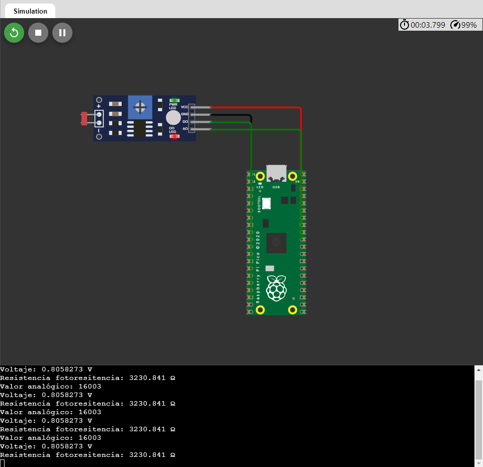

# Exposición de la unidad 1 - Sensores
## FOTORESISTENCIA
### Depto de Sistemas y Computación
### Ing. En Sistemas Computacionales
### SISTEMAS PROGRAMABLES 23a
### **Autor:** *Elías Martínez Jesús*
### Fecha de revisión: 13/09/2023

#### ¿Qué es una fotoresistencia?
La fotorresistencia es un componente electrónico cuya resistencia disminuye con el aumento de intensidad de luz incidente. También puede ser llamado fotoconductor, célula fotoeléctrica o resistor dependiente de las luz. Los valores de la resistencia para estos sensores varían dependiendo del uso que se le de y las luz disponible; los valores típicos son entre 1MΩ (oscuridad) y 100 MΩ (con luz).

#### ¿Cómo funciona una fotoresistencia?
Su función se basa en su composición que es el sulfuro de cadmio. Este componente tiene la capacidad de modificar su resistencia de acuerdo a la cantidad de luz que reciba. En el momento en el que la resistencia no detecte luz, los electrones se van a encontrar unidos los átomos que la conforman, pero en el momento en el que se detecta la luz, esa energía va a liberar electrones, razón por la que el material se hace más conductor y disminuye la resistencia.

#### Características de una fotoresistencia
* Los valores que se identifican están entre 1M o más en la oscuridad y de 100 con la luz brillante.
* La disipación máxima es de 50 mW-1W.
* Voltaje máximo de 600V.
* El tiempo de respuesta es una décima de segundo.

### Partes de una fotoresistencia
* Patillas
* Elemento fotoresistivo
* Carcaza

#### Tipos de fotoresistencias
* **Sulfuro de cadmio:** Las que se elaboran a partir de este material son sensibles a todas las radiaciones de tipo luminoso que son visibles.
*  **Sulfuro de plomo:** Al utilizar este material, la fotoresistencia es sensible únicamente a las radiaciones infrarrojas.

#### Ventajas de una fotoresistencia
* Son sensores muy sensibles.
* Fáciles de emplear.
* Son de bajo costo.
* No hay potencial de unión.
* Tiene una relación de la resistencia luz - oscuridad.

#### Desventajas de una fotoresistencia
* Respuesta espectral estrecha.
* Efecto de histéresis.
* La estabilidad por temperatura es baja cuando los materiales son más rápidos.
* Hay variación en el valor de la resistencia con un retardo.
* La respuesta es lenta en los materiales estables.

#### Aplicaciones de las fotoresistencias
Son usadas con regularidad en el sector de iluminación para el apagado y encendido de alumbrado como los interruptores crepusculares. También están presentes en alarmas, cámaras fotográficas o en los medidores de luz. Ahora con relación al infrarrojo, son comunes en entre las funciones de control de máquinas y en la detección de objetos.

### Ejemplo de fotoresitencia con pico W (Circuito en wokwi)

### Conclusión
La tecnología avanza y con ello la gama de componentes electrónicos, es importante que como profesionistas en el ámbito tecnológico se obtenga un amplio conocimiento de los diferentes sensores/componentes de los cuales se puede disponer para realizar diferentes circuitos/proyectos que ayuden con la automatización de procesos. La fotoresistencias es un sensor que se basa en la detección de luz o no, con lo cual realizará diferentes acciones, según lo programado con anterioridad.
